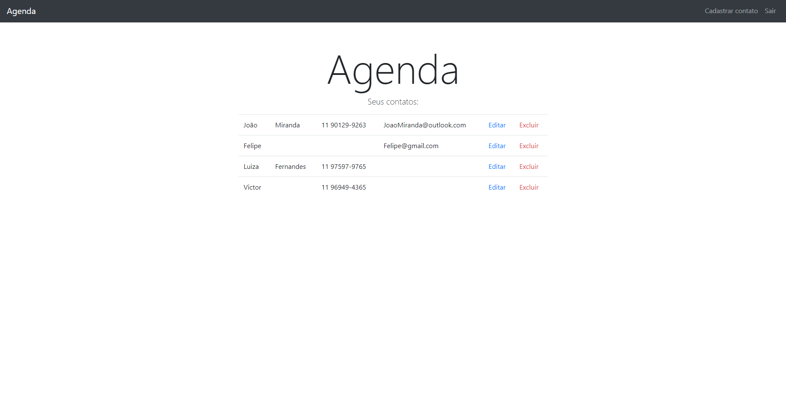
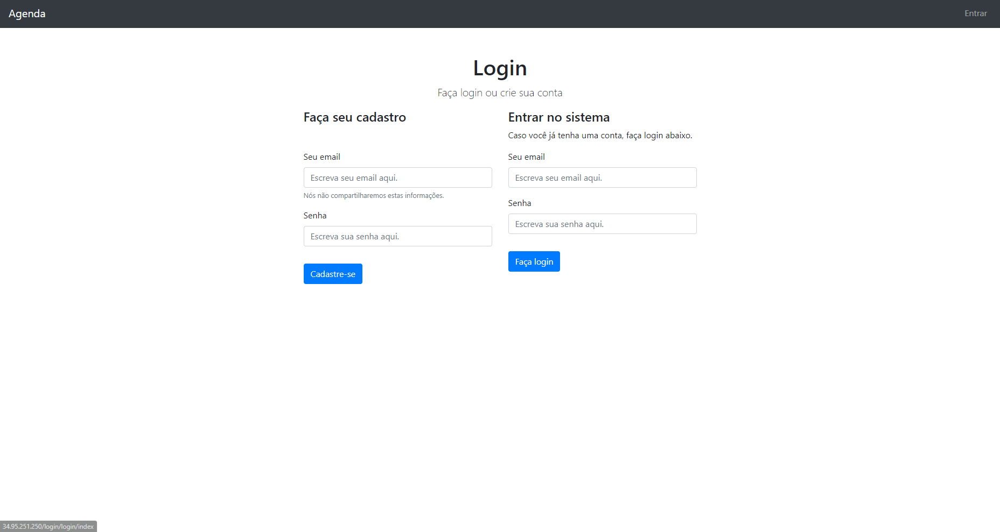
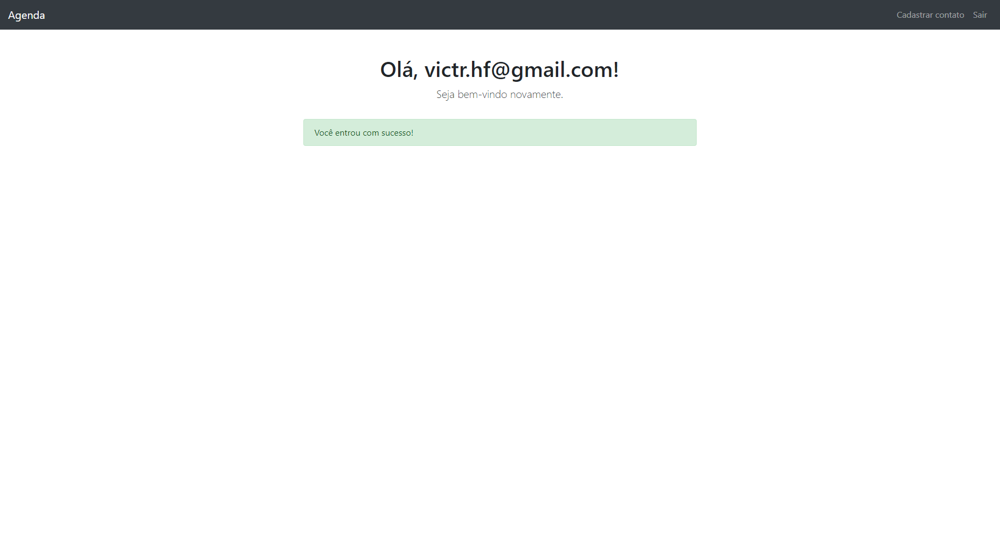
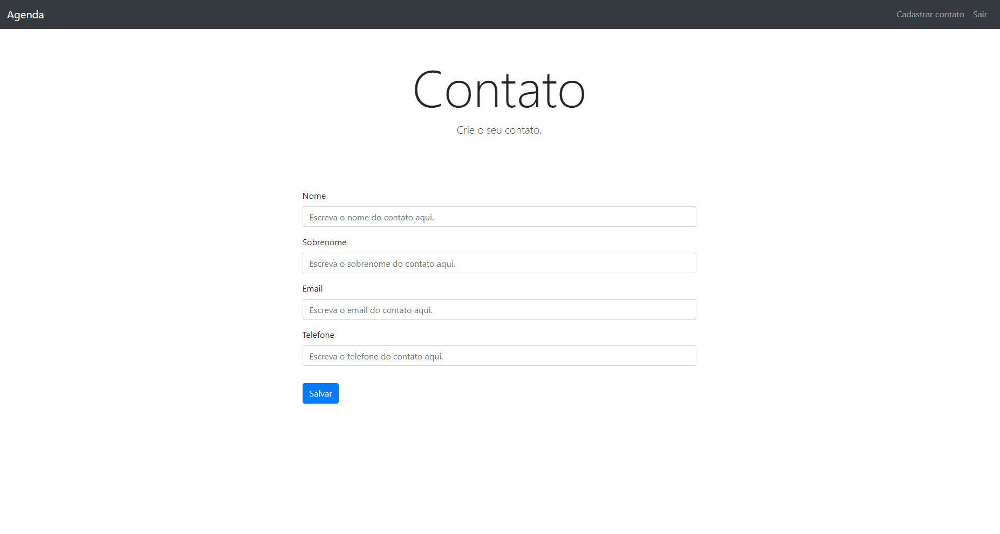

# Projeto Agenda:



## Sobre
  Esta é uma aplicação WEB feita utilizando a bibliotecas Node.js; Express. Ela tem como objetivo armazenar e organizar contatos por: Nome, Sobrenome, Número e E-mail em um banco de dados MongoDB (que falaremos melhor sobre posteriormente). Feita utilizando um modelo de arquitetura MVC e CRUD completo, este projeto te permite organizar sua agenda melhor do que nunca.



  A fins de garantir a segurança dos seus dados, este serviço utiliza criptografia com hash, utilizando o framework [Bcrypt](https://www.npmjs.com/package/bcrypt). Para evitar ataques maliciosos, utilizamos também o framework [CSRF](https://www.npmjs.com/package/csrf).





---


## Inicialização

Esta é uma aplicaçãoWEB com Banco de Dados NoSQL MongoDB integrado. Para realizar a inicialização dela é necessário a String de Conexão de um cluster MongoDB; para saber mais como criar um Clust, leia [este artigo](https://www.mongodb.com/pt-br/docs/atlas/tutorial/create-new-cluster/).

Ao concluir a criação do seu cluster e obter em mãos a sua chave de conexão, crie um arquivo "[.env](https://www.npmjs.com/package/dotenv)" no diretório desta pasta, contendo uma váriavel chamada "CONNECTIONSTRING" que guardará a key do seu BD.

``` .env
    CONNECTINGSTRING= 
```

---

## Dependências

``` json
  "dependencies": {
    "bcryptjs": "^2.4.3",
    "connect-flash": "^0.1.1",
    "connect-mongo": "^5.1.0",
    "core-js": "^3.37.1",
    "csrf": "^3.1.0",
    "css-loader": "^7.1.2",
    "csurf": "^1.11.0",
    "dotenv": "^16.4.5",
    "ejs": "^3.1.10",
    "express": "^4.19.2",
    "express-session": "^1.18.0",
    "helmet": "^7.1.0",
    "mongoose": "^8.4.4",
    "regenerator-runtime": "^0.14.1",
    "style-loader": "^4.0.0",
    "validator": "^13.12.0"
  },
  "devDependencies": {
    "@babel/cli": "^7.24.6",
    "@babel/core": "^7.24.6",
    "@babel/preset-env": "^7.24.6",
    "babel-loader": "^9.1.3",
    "nodemon": "^3.1.3",
    "webpack": "^5.91.0",
    "webpack-cli": "^5.1.4"
  }
```
 

## Serviços Node.js usados:


 


